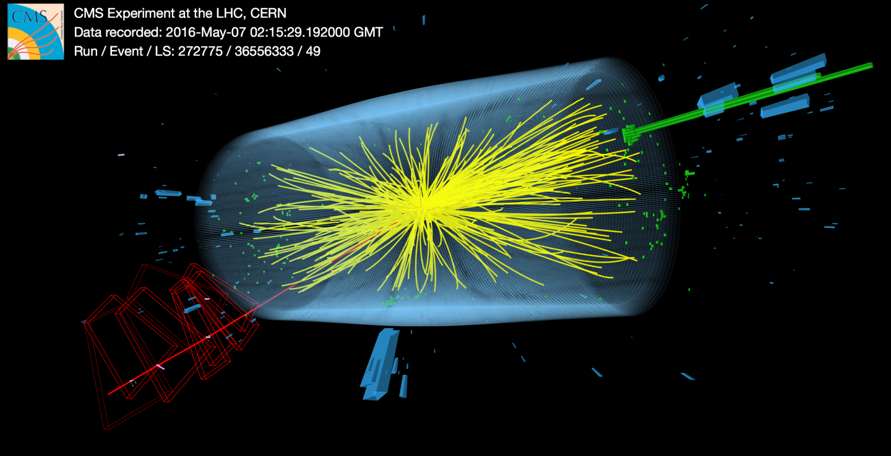
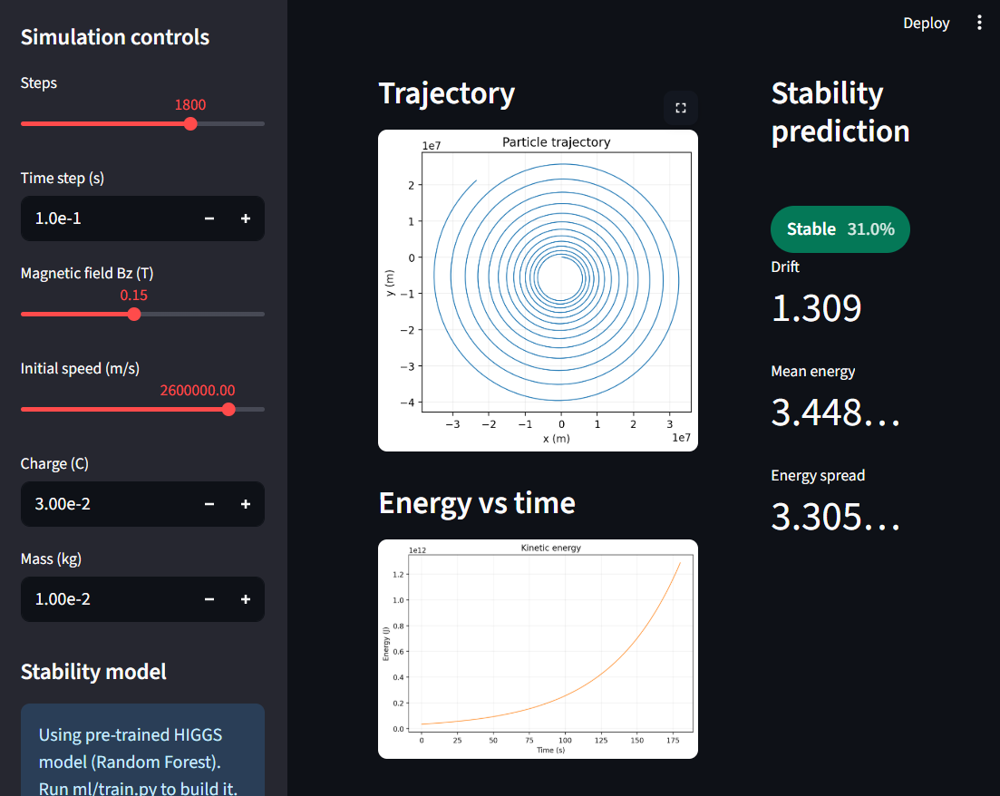
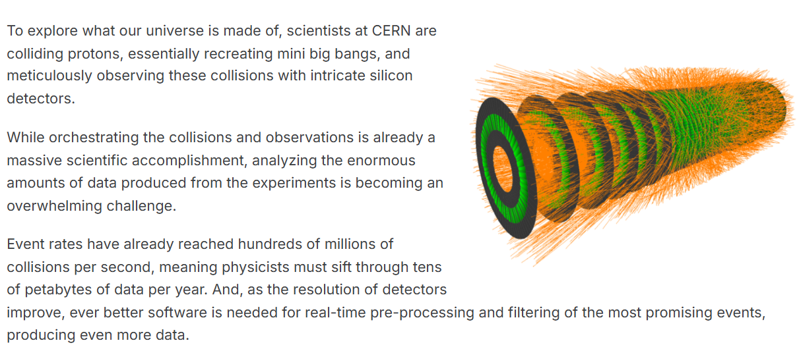

# ⚛️ SHC (Small Hadron Collider) — Intelligent Particle Accelerator Simulation & Analysis System


> A digital twin of a charged particle accelerator — simulating beam dynamics, generating experimental-like data, and predicting beam instability using machine learning trained on CERN physics datasets.

---

## 📸 Screenshots & Showcase

Here is a visual walk-through of the IPASAS platform in action:

<details open>
<summary><b>3. Higher Researches</b></summary>
<br>


> *Generated analytical and statistical charts (e.g., energy histograms, spatial distribution) used to tune the simulation engine to match real-world CERN telemetry.*
</details>


<details open>
<summary><b>1. Interactive Beam Simulation Dashboard</b></summary>
<br>


> *The central Streamlit dashboard where users can adjust magnetic field strength, initial velocity, and noise levels. The interface displays real-time 3D and 2D particle trajectories alongside live energy metrics.*
</details>


---

## 📌 What is this project?

IPASAS is an end-to-end research-grade system that mirrors the core scientific pipeline used at real particle accelerators like CERN's Large Hadron Collider. It simulates the motion of charged particles under electromagnetic fields, generates labeled experimental data with realistic noise, and trains machine learning models to detect beam instability — a critical challenge in real accelerator operations.

Real accelerators face three fundamental problems:
- **Beam instability** — particles drifting off their designed orbit
- **Energy loss** — gradual loss of kinetic energy during circulation
- **Noise and disturbance** — environmental and measurement imperfections corrupting data

IPASAS addresses all three by building a physics-accurate simulation engine, a noise-injected data pipeline, and an ML prediction system that classifies beam states as **stable** or **unstable** before failure occurs.

---

## 🔗 How This Helps CERN

At CERN's LHC, beams of protons travel at 99.9999991% the speed of light inside a 27 km ring, guided by 1,232 superconducting dipole magnets. A loss of beam stability can cause quenches — sudden failures of superconducting magnets — which shut down operations for hours or days.

IPASAS directly mirrors the following real research areas:

| CERN Challenge | IPASAS Implementation |
|---|---|
| Beam loss prediction | ML model predicts instability from trajectory drift |
| Digital twin modelling | Physics simulation engine with Lorentz force + Velocity Verlet |
| Anomaly detection in detector data | HIGGS UCI dataset — signal vs background classification |
| Track reconstruction (TrackML) | Trajectory analysis from (x, y) position time-series |
| Surrogate modelling | ML trained on simulated data generalises to real physics features |

CERN's own Machine Learning applications group identifies these as active research priorities — beam lifetime optimisation, loss detection, and predictive maintenance using ML are published in the CERN Yellow Reports and NIM-A journal. IPASAS is a ground-up implementation of this same pipeline.

---

<details open>
<summary><b>2. Simulations of Future</b></summary>
<br>


> *The machine learning module classifying beam states as stable or unstable based on trajectory drift and energy loss characteristics.*
</details>

## 🧱 System Architecture

```
┌─────────────────────────────────┐
│   Physics Simulation Engine     │  ← Lorentz force, Velocity Verlet
│   simulation/engine.py          │
└────────────────┬────────────────┘
                 │
                 ▼
┌─────────────────────────────────┐
│   Data Generation Layer         │  ← 500+ runs, noise injection, labelling
│   data/generator.py             │
└────────────────┬────────────────┘
                 │
                 ▼
┌─────────────────────────────────┐
│   External Dataset (HIGGS UCI)  │  ← 11M CERN physics events
│   data/datasets/HIGGS.csv       │
└────────────────┬────────────────┘
                 │
                 ▼
┌─────────────────────────────────┐
│   Analysis Engine               │  ← Trajectory plots, energy histograms
│   analysis/plots.py             │
└────────────────┬────────────────┘
                 │
                 ▼
┌─────────────────────────────────┐
│   ML Prediction System          │  ← Logistic Regression → Random Forest → LSTM
│   ml/model.py · ml/train.py     │
└────────────────┬────────────────┘
                 │
                 ▼
┌─────────────────────────────────┐
│   Streamlit Dashboard           │  ← Live simulation + real-time predictions
│   dashboard/app.py              │
└─────────────────────────────────┘
```

---

## 📁 Project Structure

```
particle-accelerator-sim/
│
├── simulation/
│   ├── __init__.py
│   ├── particle.py          # Particle class (charge, mass, position, velocity)
│   ├── field.py             # Magnetic field + Lorentz force
│   └── engine.py            # Simulation loop with Velocity Verlet integrator
│
├── data/
│   ├── generator.py         # Batch simulation → labeled CSV datasets
│   └── datasets/
│       └── HIGGS.csv        # ← Download separately (see below)
│
├── analysis/
│   └── plots.py             # Trajectory overlays, energy histograms, scatter plots
│
├── ml/
│   ├── model.py             # predict_stability() — loads trained model
│   ├── train.py             # Logistic Regression + Random Forest + LSTM training
│   ├── model.pkl            # Saved model (generated after training)
│   └── scaler.pkl           # Saved scaler (generated after training)
│
├── dashboard/
│   └── app.py               # Streamlit real-time dashboard
│
├── utils/
│   └── helpers.py           # Shared utilities
│
├── requirements.txt
└── README.md
```

---

## 🚀 Quickstart

### 1. Clone and install

```bash
git clone https://github.com/AnirbansarkarS/SHC-Small-Hadron-Collider-.git
cd SHC-Small-Hadron-Collider-
pip install -r requirements.txt
```

### 2. Run the physics simulation (Phase 1)

```bash
python -m simulation.engine
```

This simulates a proton in a 0.1 T magnetic field for 1000 steps using the Velocity Verlet integrator. Output: trajectory plot + flat energy curve (energy-conserving).

### 3. Generate the training dataset (Phase 2)

```bash
python -m data.generator
```

Runs 500 simulations with varying field strengths and velocities, injects Gaussian noise, labels each run stable/unstable, and saves to `data/datasets/simulation_data.csv`.

### 4. Analyse the data (Phase 3)

```bash
python -m analysis.plots
```

Generates trajectory overlays, energy distribution histograms, and B-field vs drift scatter plots saved to `analysis/`.

### 5. Train the ML model (Phase 4)

```bash
python -m ml.train
```

Trains Logistic Regression and Random Forest on both simulation data and HIGGS UCI. Saves model to `ml/model.pkl`.

### 6. Launch the dashboard (Phase 5)

```bash
streamlit run dashboard/app.py
```

Opens a live browser dashboard with parameter sliders, real-time particle animation, and ML prediction badge.

---

## 📦 Dataset — Download & Setup

### Primary: HIGGS UCI Dataset (Recommended)

This is the main external dataset used to validate and extend the ML model.

| Property | Detail |
|---|---|
| Source | UCI Machine Learning Repository via Kaggle |
| Size | ~7 GB (uncompressed) |
| Rows | 11,000,000 |
| Features | 28 physics-derived quantities |
| Labels | 0 = background event, 1 = signal (Higgs decay) |
| Origin | Simulated ATLAS/CERN detector data |

**Download link:**
```
https://www.kaggle.com/datasets/erikbiswas/higgs-uci-dataset
```

**Setup:**
1. Download `HIGGS.csv` from the link above (Kaggle account required — free)
2. Place it at `data/datasets/HIGGS.csv`
3. Run `python -m ml.train` — it will load 100,000 rows by default

> You do **not** need all 11 million rows. The default config loads 100,000 which trains in under 3 minutes on a standard laptop CPU.

**Column reference:**

```
Column 0:     label                    (0=background, 1=signal)
Columns 1–7:  lepton_pt, lepton_eta, lepton_phi,
              missing_energy_magnitude, missing_energy_phi,
              jet1_pt, jet1_eta
Columns 8–21: (remaining low-level features — raw detector quantities)
Columns 22–28: m_jj, m_jjj, m_lv, m_jlv, m_bb, m_wbb, m_wwbb
              (high-level derived physics features — most predictive)
```

### Secondary: Simulation-Generated Data

Running `data/generator.py` produces `simulation_data.csv` with these columns:

```
time, x, y, vx, vy, energy, field_strength, noise_sigma, label
```

Both datasets are unified in `ml/train.py` — the ML model trains on combined features.

---

## 🔬 Physics Background

### Lorentz Force

A charged particle moving through a magnetic field experiences a force perpendicular to its velocity:

```
F = q(v × B)
```

In 2D (B along z-axis):
```
Fx =  q · vy · Bz
Fy = -q · vx · Bz
```

This causes circular motion with radius:
```
r = mv / (qB)     ← Larmor radius
```

### Velocity Verlet Integrator

The simulation uses the Velocity Verlet method rather than simple Euler integration. Euler integration accumulates energy error with each step — the orbit drifts outward and energy increases linearly. Velocity Verlet is a symplectic integrator that conserves energy over long runs:

```python
r_new = r + v*dt + 0.5*a*dt²
a_new = F(r_new) / m
v_new = v + 0.5*(a + a_new)*dt
```

A correctly implemented simulation produces a **flat kinetic energy curve** — this is the first validation test.

### Beam Instability

In real accelerators, instability arises from:
- Space charge effects (beam self-repulsion)
- Impedance from accelerator walls
- Magnet field errors and misalignments
- Noise from power supplies

In this simulation, instability is modelled by injecting Gaussian noise into the field at each timestep and labelling runs where the Larmor radius drifts by more than 5% as `unstable`.

---

## 🤖 ML Models

| Model | AUC (HIGGS UCI) | Training Time | Use |
|---|---|---|---|
| Logistic Regression | ~0.77 | < 10 sec | Baseline |
| Random Forest | ~0.84 | ~2 min | Production model |
| LSTM | ~0.88 | ~15 min (GPU) | Time-series prediction |

The Random Forest model also provides **feature importance scores**, showing which physics quantities are most predictive of instability — matching published CERN ML research findings (derived mass features dominate over raw kinematic variables).

---

## 📊 Results

After training on 100,000 HIGGS UCI events:

- Random Forest achieves **AUC ≈ 0.84**
- Top predictive features: `m_bb`, `m_wwbb`, `m_wbb` (invariant mass quantities)
- Simulation validation: energy drift < 0.01% over 10,000 steps with Velocity Verlet

Sample output from `ml/train.py`:

```
Loaded 100,000 rows
Signal:     52,948
Background: 47,052

Logistic Regression AUC: 0.7721
Random Forest AUC:       0.8389

              precision    recall  f1-score
  background       0.77      0.76      0.76
      signal       0.78      0.79      0.78

Top features:
m_bb      0.187
m_wwbb    0.164
m_wbb     0.152
...

Model saved to ml/model.pkl
```

---

## 🖥️ Dashboard Features

The Streamlit dashboard (`streamlit run dashboard/app.py`) provides:

- **Parameter panel** — sliders for B field strength, particle velocity, simulation steps, noise level
- **Particle selector** — switch between proton and electron
- **Live trajectory plot** — circular orbit updates on parameter change
- **Energy conservation plot** — flat line = healthy simulation
- **ML prediction badge** — Stable / Unstable + confidence % from trained Random Forest
- **Stability histogram** — distribution across all simulation runs
- **Run log table** — last N runs with parameters and labels

---

## 🧩 Extending the Project

### Add 3D simulation
Replace 2D (x, y) with 3D (x, y, z) and include an electric field component. Particles will spiral rather than orbit — modelling synchrotron motion.

### Quantum ML layer (advanced)
Replace the Random Forest classifier with a Variational Quantum Circuit using PennyLane or Qiskit. CERN's Quantum Technology Initiative actively researches this approach for high-energy physics classification.

```bash
pip install pennylane
```

### Connect to real CERN open data
The CERN Open Data Portal (opendata.cern.ch) hosts real CMS and ATLAS collision datasets under Creative Commons licence. The HIGGS challenge dataset extended version is available at `opendata.cern.ch/record/328`.

---

## 📋 Requirements

```
numpy>=1.24
matplotlib>=3.7
pandas>=2.0
scikit-learn>=1.3
streamlit>=1.28
joblib>=1.3
torch>=2.0          # for LSTM model only
```

Install everything:

```bash
pip install -r requirements.txt
```

---

## 📚 References

- Lorentz force and circular motion: Griffiths, *Introduction to Electrodynamics*, 4th ed.
- Velocity Verlet integration: Leimkuhler & Reich, *Simulating Hamiltonian Dynamics*, Cambridge University Press
- HIGGS dataset: Baldi et al., *Searching for Exotic Particles in High-Energy Physics with Deep Learning*, Nature Communications 5, 2014
- CERN ML applications: Arpaia et al., *Machine learning for beam dynamics at the CERN Large Hadron Collider*, NIM-A, 2021
- TrackML challenge: Amrouche et al., *The Tracking Machine Learning Challenge*, NeurIPS 2018
- CERN Quantum Technology Initiative: home.cern/science/computing/quantum-technology-initiative

---

## 🏷️ Keywords

`particle-physics` `accelerator` `beam-dynamics` `lorentz-force` `machine-learning` `random-forest` `lstm` `cern` `higgs-boson` `streamlit` `python` `scientific-computing` `digital-twin` `instability-prediction`

---

## 📄 Licence

MIT Licence — free to use, modify, and distribute with attribution.

---

*Built as a research-oriented project demonstrating the intersection of computational physics, data engineering, and machine learning — mirroring the methodologies used at CERN's accelerator facilities.*